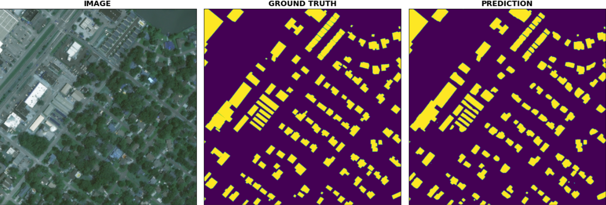

# PROBLEM DESCRIPTION

In this repository you can train models for the [xView2 challenge](https://xview2.org) which goal was to create an accurate and efficient model for building localization and damage assessment based on satellite imagery. For building localization predicted pixel values must be either 0 (no building) or 1 (building), whereas for building damage classification: 1 (undamaged building), 2 (minor damaged building), 3 (major damaged building), 4 (destroyed building)



# METHODS

I provide scripts to train U-Net models with the following extensions:
- U-Net encoders:
    - [ResNeSt](https://arxiv.org/abs/2004.08955) 50, 101, 200, 269
    - [ResNet](https://arxiv.org/abs/1512.03385) 50, 101, 152
- Loss functions:
    - [Dice](https://arxiv.org/abs/1606.04797)
    - [Focal](https://arxiv.org/abs/1708.02002)
    - [Online Hard Example Mining](https://arxiv.org/abs/1812.05802)
    - [CORAL](https://arxiv.org/abs/1901.07884) (for damage assessment task only)
    - [Cross Entropy](https://pytorch.org/docs/stable/generated/torch.nn.CrossEntropyLoss.html)
    - [Mean Square Error](https://pytorch.org/docs/stable/generated/torch.nn.MSELoss.html) (for damage assessment task only)
- U-Net variants for damage assessment:
    - Siamese - share weights for pre and post disaster images; two variants - with shared encoder only or encoder and decoder
    - Fused - use two U-Nets with fused blocks to aggregate context from pre and post disaster images; two variants - with fused encoder only or encoder and decoder
    - Parallel - use two U-Nets for pre and post images separately; two variants - with parallel encoder only or encoder and decoder
    - Concatenated - use 6-channel input i.e. concatenation of pre and post images
- [Deep Supervision](https://arxiv.org/pdf/1703.07523.pdf)
- [Attention](https://arxiv.org/abs/1804.03999)
- [Pyramid Parsing Module](https://arxiv.org/abs/1612.01105)
- [Atrous Spatial Pyramid Pooling Module](https://arxiv.org/abs/1706.05587)
- Test time augmentation
- Supported optimizers: sgd, adam, radam, adabelief, adabound, adamp, novograd
- Supported learning rate scheduler: Noam

In the [usage](#USAGE) section you can check the full list of available flags and extensions, whereas in [examples](#EXAMPLES) I provide few commands for launching training and evaluation.

# DATASET

The dataset used in the contests is called xBD and contains 22.068 images, each of shape 1024x1024x3. See the [xBD paper](https://arxiv.org/abs/1911.09296) for more details. The data is available to download from xView2 challenge website (you must register and login to download it).

This repository assumes the following layout data layout:

```
/data
 ├── train
 │      ├── images
 │      │      └── <image_id>.png
 │      │      └── ...
 │      └── targets
 │             └── <image_id>.png
 │             └── ...
 ├── val
 │      ├── images
 │      │      └── <image_id>.png
 │      │      └── ...
 │      └── targets
 │             └── <image_id>.png
 │             └── ...
 └── test
        ├── images
        │      └── <image_id>.png
        │      └── ...
        └── targets
               └── <image_id>.png
               └── ...
```

- *train* directory corresponds to *train* and *tier3* challenge datasets.
- *val* directory corresponds to *test* challenge dataset (dataset used during the contest to evaluate predictions).
- *test* directory corresponds to *holdout* challenge dataset (dataset used for the final leaderboard ranking).

To convert the labels from *json* to *png* see `utils/convert2png.py` script. For example use: `python utils/convert2png.py --data DATA_PATH/train` to convert json files within `DATA_PATH/train` directory.

# INSTALLATION

This repository contains Dockerfile which handles all required dependencies. Below I present the steps to prepare the environment:

1. Clone repository `git clone https://github.com/michal2409/xview2`

2. Build docker image `docker build -t xview2 .`

3. Run container `docker run -it --rm --gpus all --shm-size=8g --ulimit memlock=-1 --ulimit stack=67108864 -v RESULTS_PATH:/results -v DATA_PATH:/data xview2 bash` where **DATA_PATH** is path to xBD directory with layout as described in [dataset](#DATASET) section and **RESULTS_PATH** is a path to the directory for artifacts like checkpoints, logger output or prediction masks.

# USAGE

After completing the steps from [installation](#INSTALLATION) section you are ready to execute the code. Below is the usage of `main.py` script which allows you to start the training and evaluating the model.
 
```
usage: python main.py [--optional arguments] 

optional arguments:
  -h, --help            show this help message and exit
  --exec_mode           Execution mode. One from {train,eval}
  --data                Path to data directory
  --results             Path to results directory
  --gpus {0,1}          Number of gpus to use
  --num_workers         Number of subprocesses to use for data loading
  --batch_size          Training batch size
  --val_batch_size      Validation or test batch size
  --precision {16,32}   Training and evaluation precision
  --epochs              Maximum number of epochs
  --patience            Early stopping patience
  --ckpt                Path to pretrained checkpoint
  --logname             Name of logging file
  --ckpt_pre            Path to pretrained checkpoint of localization model used to initialize network for damage assessment
  --type {pre,post}     Type of task to run; pre - localization, post - damage assessment
  --seed                Seed
  --optimizer           Optimizer
  --dmg_model           U-Net variant for damage assessment task
  --encoder             U-Net encoder
  --loss_str            String used for creation of loss function
  --init_lr             initial learning rate for scheduler
  --lr                  learning rate (or target learning rate for scheduler)
  --final_lr            final learning rate for scheduler
  --weight_decay        weight decay
  --momentum            momentum for SGD
  --dilation            Dilation rate for encoder. One from {1,2,4}
  --tta                 Enable test time augmentation
  --use_scheduler       Enable learning rate scheduler
  --warmup              Warmup epochs for learning rate scheduler
  --ppm                 Use pyramid pooling module
  --aspp                Use atrous spatial pyramid pooling
  --no_skip             Disable skip connections in UNet
  --deep_supervision    Enable deep supervision
  --attention           Enable attention module at the decoder
  --autoaugment         Use imageNet auto augment pipeline
  --interpolate         Don't use decoder and just interpolate feature map from encoder
  --dec_interp          Use interpolation instead of transposed convolution in decoder
```

# EXAMPLES

To start training the localization task with the resnest200 encoder, cross entropy + dice loss function, deep supervision, attention and test time augmentation with 1 gpu and batch size 16 for training and 8 for evaluation, launch:

```
python main.py --type pre --encoder resnest200 --loss_str ce+dice  --deep_supervision --attention --tta --gpus 1 --batch_size 16 --val_batch_size 8 --gpus 1
```

To start training the damage assessment task with the siamese version of U-Net, resnest200 encoder, focal + dice loss function, deep supervision, attention and test time augmentation with 8 gpus and batch size 16 for training and 8 for evaluation, launch:

```
python main.py --type post --dmg_model siamese --encoder resnest200 --loss_str focal+dice --attention --deep_supervision --tta --gpus 8 --batch_size 16 --val_batch_size 8 
```

To evaluate trained model with evaluation batch size 8 on the test set launch:

```
python main.py --type {pre, post} --ckpt <path/to/checkpoint> --gpus 1 --val_batch_size 8
```

# REFERENCES

- [xView2 challange](https://xview2.org)
- [xBD paper](https://arxiv.org/abs/1911.09296)
- [xView top5 solutions](https://github.com/DIUx-xView)
- [ResNeSt: Split-Attention Networks](https://arxiv.org/abs/2004.08955)
- [U-Net: Convolutional Networks for Biomedical Image Segmentation](https://arxiv.org/abs/1505.04597)
- [PyTorch Lightning](https://www.pytorchlightning.ai/)
- [Albumentations](https://albumentations.ai/docs/)
