## Problem description

In this repository, you can train models for the [xView2 challenge](https://xview2.org) to create an accurate and efficient model for building localization and damage assessment based on satellite imagery. For building localization, predicted pixel values must be either 0 (no building) or 1 (building), whereas for building damage classification: 1 (undamaged building), 2 (minor damaged building), 3 (major damaged building), 4 (destroyed building)

IMAGE| LABEL | PREDICTION |
:-------------------------:|:-------------------------:|:-------------------------:
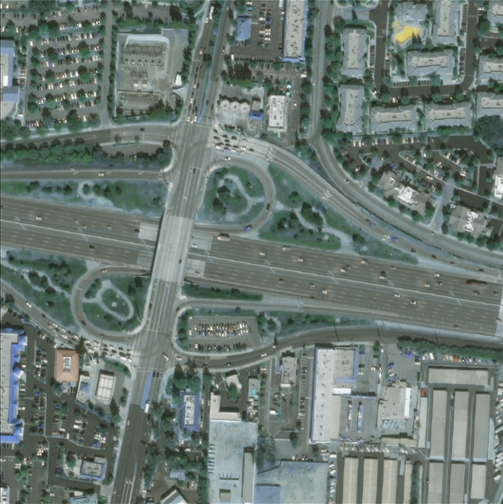  |  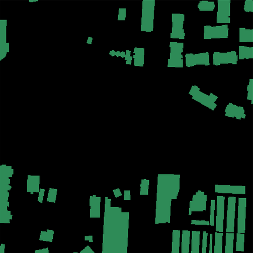 |  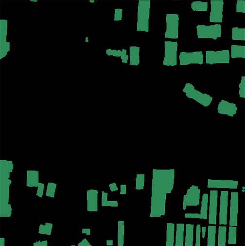
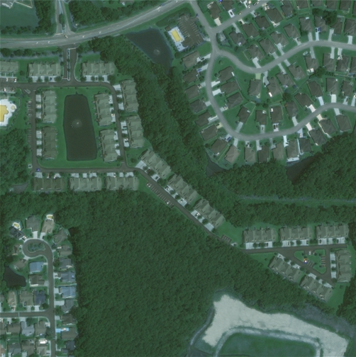  |  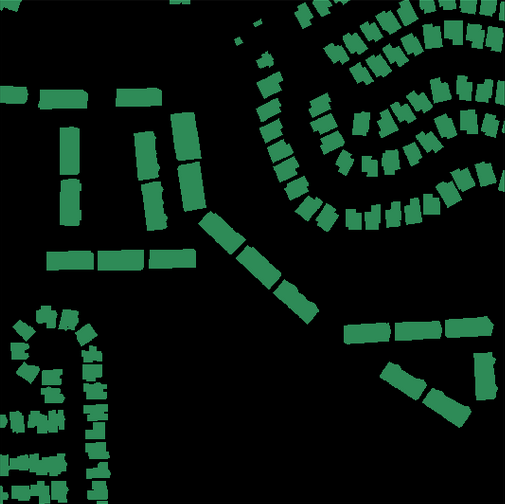 |  
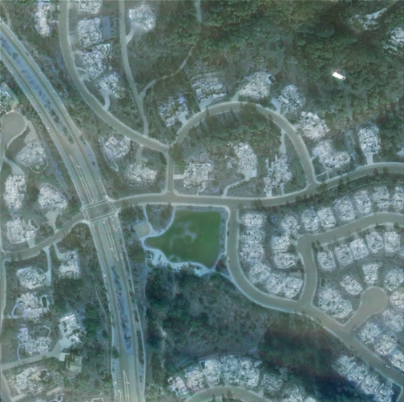  |  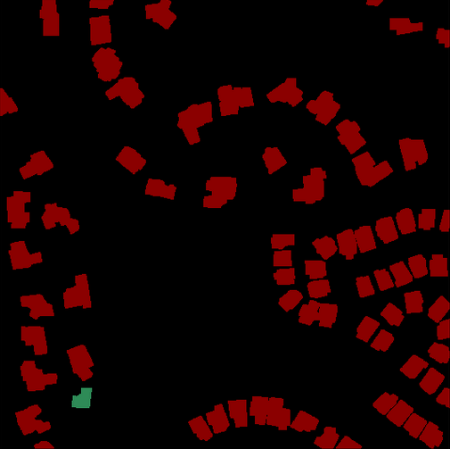 |  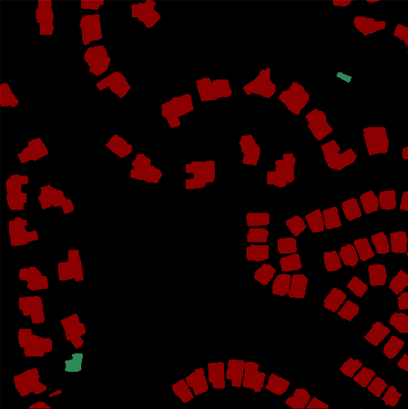
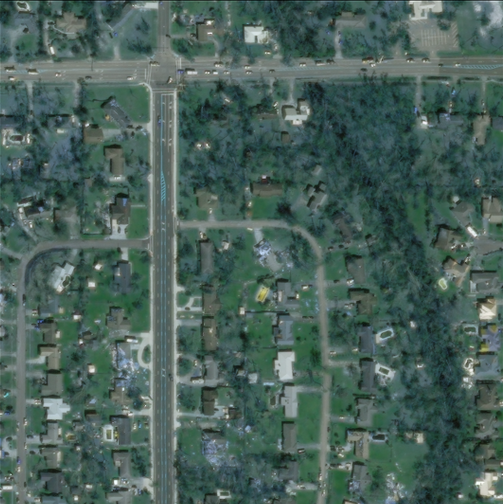  |  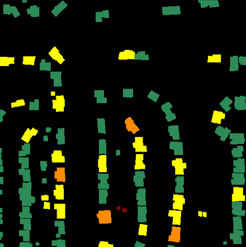 |  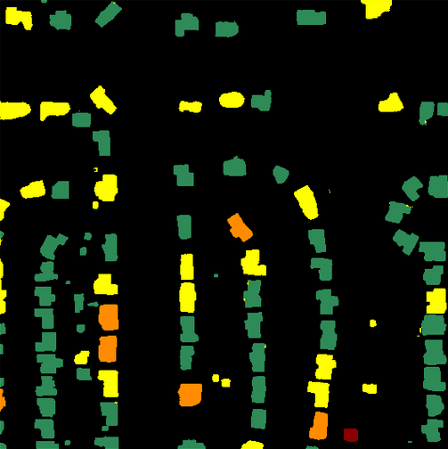


## Methods

The following options can be used to train U-Net models:
- U-Net encoders:
    - [ResNeSt](https://arxiv.org/abs/2004.08955) 50, 101, 200, 269
    - [ResNet](https://arxiv.org/abs/1512.03385) 50, 101, 152
- Loss functions:
    - [Dice](https://arxiv.org/abs/1606.04797)
    - [Focal](https://arxiv.org/abs/1708.02002)
    - [Online Hard Example Mining](https://arxiv.org/abs/1812.05802)
    - [CORAL](https://arxiv.org/abs/1901.07884) (for damage assessment task only)
    - [Cross Entropy](https://pytorch.org/docs/stable/generated/torch.nn.CrossEntropyLoss.html)
    - [Mean Square Error](https://pytorch.org/docs/stable/generated/torch.nn.MSELoss.html) (for damage assessment task only)
- U-Net variants for damage assessment:
    - Siamese - share weights for pre and post disaster images; two variants - with shared encoder only or encoder and decoder
    - Fused - use two U-Nets with fused blocks to aggregate context from pre and post disaster images; two variants - with fused encoder only or encoder and decoder
    - Parallel - use two U-Nets for pre and post images separately; two variants - with parallel encoder only or encoder and decoder
    - Concatenated - use 6-channel input i.e. concatenation of pre and post images
- [Deep Supervision](https://arxiv.org/pdf/1703.07523.pdf)
- [Attention](https://arxiv.org/abs/1804.03999)
- [Pyramid Parsing Module](https://arxiv.org/abs/1612.01105)
- [Atrous Spatial Pyramid Pooling Module](https://arxiv.org/abs/1706.05587)
- Test time augmentation
- Supported optimizers: SGD, Adam, RAdam, Adabelief, Adabound, Adamp, Novograd
- Supported learning rate scheduler: Noam

In the [usage](#usage) section, you can find the full list of available options whereas in [examples](#examples) you can find a few commands for launching training and evaluation.

## Dataset

The dataset used in the contests is called xBD and contains 22,068 images each of 1024x1024 size with RGB colors (see the [xBD paper](https://arxiv.org/abs/1911.09296) for more details). The data is available for download from the [xView2 challenge website](https://xview2.org) (registration required).

This repository assumes the following data layout:

```
/data
 ├── train
 │      ├── images
 │      │      └── <image_id>.png
 │      │      └── ...
 │      └── targets
 │             └── <image_id>.png
 │             └── ...
 ├── test
 │      ├── images
 │      │      └── <image_id>.png
 │      │      └── ...
 │      └── targets
 │             └── <image_id>.png
 │             └── ...
 └── holdout
        ├── images
        │      └── <image_id>.png
        │      └── ...
        └── targets
               └── <image_id>.png
               └── ...
```

For example to convert json files within `DATA_PATH/train` directory, use:
```
python utils/convert2png.py --data DATA_PATH/train
```

## Installation

The repository contains Dockerfile which handles all required dependencies. Here are the steps to prepare the environment:

1. Clone repository: `git clone https://github.com/michal2409/xview2 && cd xview2`

2. Build docker image: `docker build -t xview2 .`

3. Run docker container:
```
docker run -it --rm --gpus all --shm-size=8g --ulimit memlock=-1 --ulimit stack=67108864 -v RESULTS_PATH:/results -v DATA_PATH:/data xview2 bash
```
where
- **DATA_PATH** is the path to xBD directory with layout as described in the [dataset](#dataset) section
- **RESULTS_PATH** is the path to the directory for artifacts like checkpoints, log output or predictions

## Usage

Here are the options for the `main.py` script:
 
```
usage: python main.py [--optional arguments] 

optional arguments:
  -h, --help            show this help message and exit
  --exec_mode {train,eval}
                        Execution mode of main script
  --data                Path to the data directory
  --results             Path to the results directory
  --gpus                Number of gpus to use
  --num_workers         Number of subprocesses to use for data loading
  --batch_size          Training batch size
  --val_batch_size      Evaluation batch size
  --precision {16,32}   Numerical precision
  --epochs              Max number of epochs      
  --patience            Early stopping patience
  --ckpt                Path to pretrained checkpoint
  --logname             Name of logging file
  --ckpt_pre            Path to pretrained checkpoint of localization model used to initialize network for damage assesment
  --type {pre,post}     Type of task to run; pre - localization, post - damage assesment
  --seed
  --optimizer {sgd,adam,adamw,radam,adabelief,adabound,adamp,novograd}
  --dmg_model {siamese,siameseEnc,fused,fusedEnc,parallel,parallelEnc,diff,cat}
                        U-Net variant for damage assessment task
  --encoder {resnest50,resnest101,resnest200,resnest269,resnet50,resnet101,resnet152}
                        U-Net encoder
  --loss_str            String used for creation of loss function, e.g focal+dice creates the loss function as sum of focal and dice.
                        Available functions: dice, focal, ce, ohem, mse, coral
  --use_scheduler       Enable Noam learning rate scheduler
  --warmup              Warmup epochs for Noam learning rate scheduler
  --init_lr             Initial learning rate for Noam scheduler
  --final_lr            Final learning rate for Noam scheduler
  --lr                  Learning rate, or a target learning rate for Noam scheduler
  --weight_decay        Weight decay (L2 penalty)
  --momentum            Momentum for SGD optimizer
  --dilation {1,2,4}    Dilation rate for a encoder, e.g dilation=2 uses dilation instead of stride in the last encoder block
  --tta                 Enable test time augmentation
  --ppm                 Use pyramid pooling module
  --aspp                Use atrous spatial pyramid pooling
  --no_skip             Disable skip connections in UNet
  --deep_supervision    Enable deep supervision
  --attention           Enable attention module at the decoder
  --autoaugment         Use imageNet autoaugment pipeline
  --interpolate         Interpolate feature map from encoder without a decoder
  --dec_interp          Use interpolation instead of transposed convolution in a decoder
```

## Examples

To train the building localization task with the resnest200 encoder, cross entropy + dice loss function, deep supervision, attention and test time augmentation with 1 gpu and batch size 16 for training and 8 for evaluation, launch:

```
python main.py --type pre --encoder resnest200 --loss_str ce+dice --deep_supervision --attention --tta --gpus 1 --batch_size 16 --val_batch_size 8 --gpus 1
```

To train the building damage assessment task with the siamese version of U-Net, resnest200 encoder, focal + dice loss function, deep supervision, attention and test time augmentation with 8 gpus and batch size 16 for training and 8 GPUs for evaluation, launch:

```
python main.py --type post --dmg_model siamese --encoder resnest200 --loss_str focal+dice --attention --deep_supervision --tta --gpus 8 --batch_size 16 --val_batch_size 8 
```

To run inference with batch size 8 on the test set, launch:

```
python main.py --exec_mode eval --type {pre,post} --ckpt <path/to/checkpoint> --gpus 1 --val_batch_size 8
```

To post process the saved predictions during inference, launch:

```
python utils/post_process.py
```

To get the final score, launch:

```
python utils/xview2_metrics.py /results/predictions /results/targets /results/score.json && cat /results/score.json
```

## References

- [xView2 challange](https://xview2.org)
- [xBD paper](https://arxiv.org/abs/1911.09296)
- [xView2 top 5 solutions](https://github.com/DIUx-xView)
- [ResNeSt: Split-Attention Networks](https://arxiv.org/abs/2004.08955)
- [U-Net: Convolutional Networks for Biomedical Image Segmentation](https://arxiv.org/abs/1505.04597)
- [PyTorch Lightning](https://www.pytorchlightning.ai/)
- [Albumentations](https://albumentations.ai/docs/)
